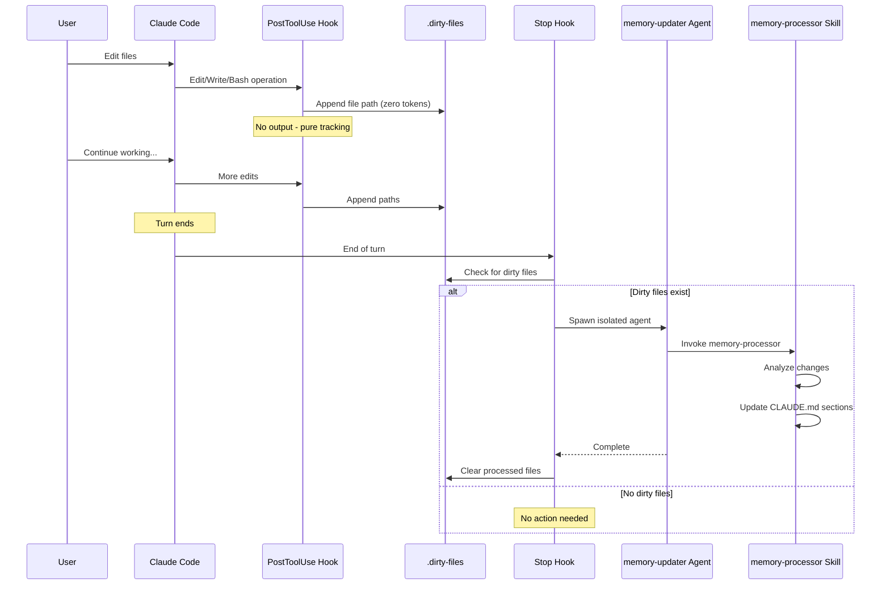

# claude-code-auto-memory

**Your CLAUDE.md, always in sync.** Minimal tokens. Zero config. Just works.

A Claude Code plugin that watches what Claude Code edits, deletes, and moves - then quietly updates your project memory in the background. No manual maintenance needed.

[](https://claude.ai/code)
[](LICENSE)
[]()
[]()

## The Problem

CLAUDE.md files become stale as codebases evolve:

- Build commands change but memory stays outdated
- Architecture shifts go unrecorded
- Code conventions drift without memory updates
- New team members get incorrect context

**Manual maintenance is tedious and often forgotten.**

## The Solution

claude-code-auto-memory automatically updates CLAUDE.md when Claude Code makes changes. Processing happens in an isolated agent, so it doesn't consume your main conversation's context window.

```
Claude Code edits code -> Plugin tracks changes -> Isolated agent updates memory -> Context stays fresh
```

## Features

- **Automatic sync**: Tracks Edit/Write/Bash operations and updates CLAUDE.md at end of turn
- **Bash operation tracking**: Detects rm, mv, git rm, git mv, unlink commands
- **Minimal-token tracking**: PostToolUse hook has no output; stop hook triggers isolated agent
- **Isolated processing**: Agent runs in separate context window, doesn't consume main session tokens
- **Marker-based updates**: Only modifies AUTO-MANAGED sections, preserves manual content
- **Subtree support**: Hierarchical CLAUDE.md for monorepos

## Installation

### From Marketplace

```bash
claude plugin marketplace add severity1/claude-code-marketplace
claude plugin install auto-memory@claude-code-marketplace
```

### Local Development

```bash
# Add local marketplace
claude plugin marketplace add /path/to/claude-code-auto-memory/.dev-marketplace/.claude-plugin/marketplace.json

# Install from local
claude plugin install auto-memory@local-dev
```

## Commands

### `/auto-memory:init`

Initialize CLAUDE.md structure for your project with an interactive wizard.

```
/auto-memory:init
```

The wizard will:
1. Analyze your codebase structure
2. Detect frameworks and build commands
3. Identify subtree candidates (for monorepos)
4. Present findings for your approval
5. Generate CLAUDE.md with auto-managed sections

### `/auto-memory:calibrate`

Force a full recalibration of all CLAUDE.md files.

```
/auto-memory:calibrate
```

### `/auto-memory:status`

Show current sync status and pending changes.

```
/auto-memory:status
```

## How It Works



### Architecture Overview

```
PostToolUse Hook (Edit|Write|Bash)
    |
    v (append file paths)
.claude/.dirty-files
    |
    v (end of turn)
Stop Hook
    |
    v (spawn agent)
memory-updater Agent (isolated context)
    |
    v (invoke skill)
memory-processor Skill
    |
    v
CLAUDE.md updated
```

### Token Efficiency

- **PostToolUse hook**: Zero token cost (no output)
- **Stop hook**: Minimal output only when dirty files exist
- **Agent**: Runs in isolated context window - doesn't consume main session tokens
- **Skills**: Progressive disclosure - load only when invoked

## CLAUDE.md Format

Auto-managed sections use HTML comment markers:

```markdown
<!-- AUTO-MANAGED: section-name -->
Content automatically updated by plugin
<!-- END AUTO-MANAGED -->

<!-- MANUAL -->
Content never touched by plugin
<!-- END MANUAL -->
```

### Supported Sections

- `project-description` - Project overview
- `build-commands` - Build, test, lint commands
- `architecture` - Directory structure, components
- `conventions` - Code standards, naming patterns
- `patterns` - AI-detected coding patterns
- `git-insights` - Decisions from commit history
- `best-practices` - From official Claude Code docs

## Development

### Setup

```bash
# Install dev dependencies
uv sync --extra dev

# Run tests
uv run pytest

# Format code
uv run ruff format .

# Lint
uv run ruff check .

# Type check
uv run mypy .
```

### Project Structure

```
claude-code-auto-memory/
├── .claude-plugin/
│   └── plugin.json           # Plugin metadata
├── hooks/
│   └── hooks.json            # Hook registration
├── scripts/
│   ├── post-tool-use.py      # Track file changes
│   └── stop.py               # End-of-turn trigger
├── agents/
│   └── memory-updater.md     # Orchestrator agent
├── skills/
│   ├── memory-processor/     # Update processing
│   └── codebase-analyzer/    # Init wizard
├── commands/
│   └── auto-memory/
│       ├── init.md
│       ├── calibrate.md
│       └── status.md
└── tests/
```

## Why claude-code-auto-memory?

| Feature | claude-code-auto-memory | Other Solutions |
|---------|-------------------|-----------------|
| Token overhead | **Minimal** (isolated agent) | Hook output adds tokens |
| External deps | **None** | SQLite, Vector DBs, Workers |
| Processing | **Isolated agent** | Inline or external service |
| Updates | **Marker-based** | Full file regeneration |
| Monorepo | **Subtree CLAUDE.md** | Root only |
| Config required | **None** | Config files needed |

See also: [memory-store-plugin](https://github.com/julep-ai/memory-store-plugin), [claude-mem](https://github.com/thedotmack/claude-mem), [claude-code-branch-memory-manager](https://github.com/Davidcreador/claude-code-branch-memory-manager)

## License

MIT

---

**Keywords**: Claude Code plugin, CLAUDE.md, automatic memory, memory management, context persistence, token-efficient, zero-config, monorepo, AI coding assistant
